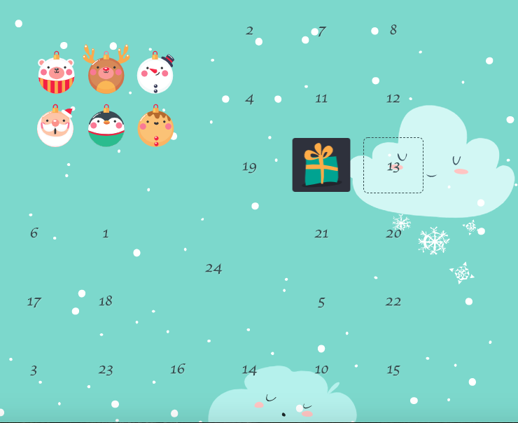

# An advent calendar written in HTML/JS/CSS

A short project for my nephews and nieces.
Thanks to [Envato Tuts+](http://webdesign.tutsplus.com) tutorials! The main parts of the code are from there. I just did some modifications.

Some highlights:

* The design is fully adjustable
* Looked doors if the date is not reached up to now
* Give a message to the user how long to wait until you can open the door
* Some animations when opening the doors
* Repeatable for every year, just modify the first line in *calendar.js*
* If you want to test, just change the month to current month (*calendar.js*, line *new Date(current_year +"-12-" + day)* )

How to use:

* Download the repository and open *calendar.html*

Have fun!

Note: This is a beginners project! If you have a more performant solution feel free to text me!

